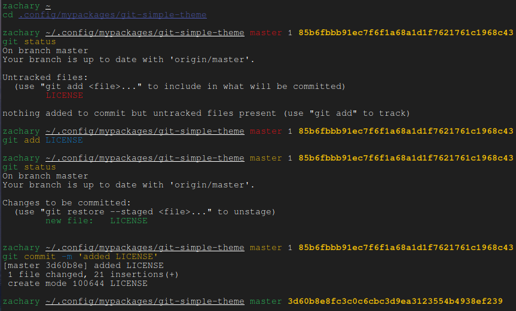

# GIT SIMPLE THEME

Git simple theme is a zsh framework independent theme for displaying git info. If inside a git directory the end of the prompt will be git branch, both number of unstaged and staged changes if present nothing or one of them if neither or one is not present in that order, and then the current commit. Further more the color of the branch will be green if no changes since last commit, yellow if only staged changes are present and red if unstaged changes are present
